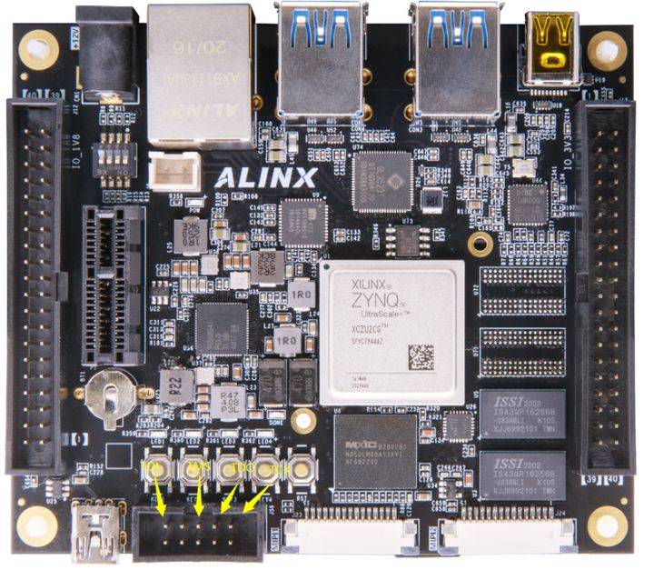
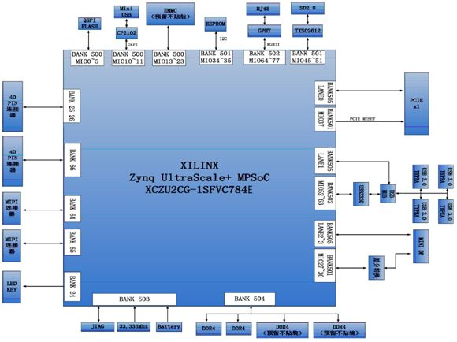
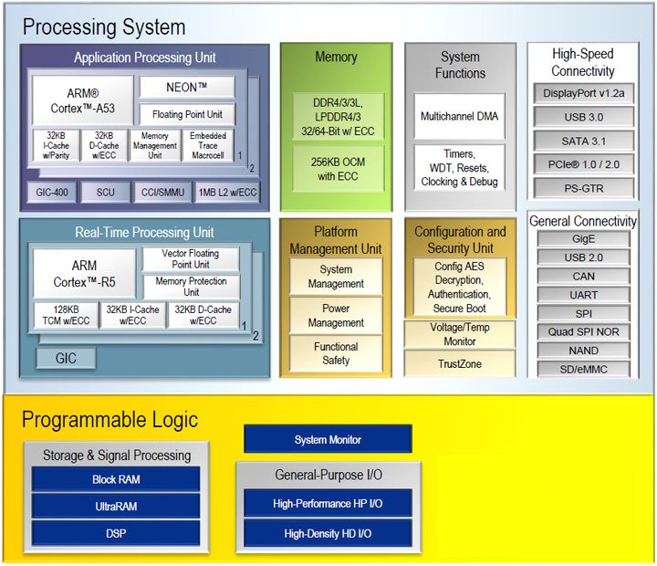
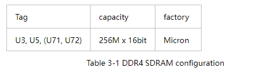
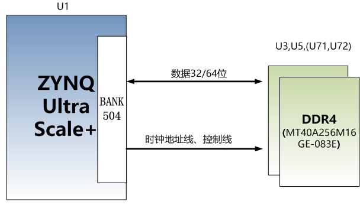

# zynq ZU2CG chip ultrascale + MPSoC FPGA, axu2cgb board

  

## Original statement:
 
 
This original tutorial was created by Xinyi Electronic Technology (Shanghai) Co., Ltd. (ALINX). The copyright belongs to our company. If you need to reprint, you need to authorize and indicate the source.

## Introduction:
 
 
AXU2CGA/B is characterized by its small size and extensive peripherals. The main chip adopts Xilinx's Zynq UltraScale+ MPSoCs CG series chip, the model is XCZU2CG-1SFVC784E. Two DDR4 (1GB, 32bit) and one 256Mb QSPI FLASH are mounted on the PS side of AXU2CGA. The PS side of AXU2CGB is equipped with 4 DDR4 (2GB, 32bit), 1 8GB eMMC FLASH memory chip and 1 256Mb QSPI FLASH.
 
Peripheral interfaces include 1 MINI DP interface, 4 USB3.0 interfaces, 1 Gigabit Ethernet interface, 1 USB serial port, 1 PCIE interface, 1 TF card interface, 2 40-pin expansion ports, 2 MIPI Interface and button LEDs.
 
The following figure shows the structure diagram of the entire development system:
 
The main goal of the project is to create an autonomous Wi-Fi weather station based on STM32F103. ESP-01 is used for transmitt data to server and BME280 for getting temperature, humidity, pressure readings. In the future, this weather station will become part of the smart home.

  

## ZYNQ chip
The PS system of the XCZU2CG-1SFVC784E chip integrates two ARM Cortex™-A53 processors with a speed of up to 1.2Ghz and supports level 2 Cache; it also contains two Cortex-R5 processors with a speed of up to 500Mhz.
 
XCZU2CG supports 32-bit or 64-bit DDR4, LPDDR4, DDR3, DDR3L, LPDDR3 memory chips, with rich high-speed interfaces on the PS side such as PCIE Gen2, USB3.0, SATA 3.1, DisplayPort; it also supports USB2.0, Gigabit Ethernet, SD/SDIO, I2C, CAN, UART, GPIO and other interfaces. The PL end contains a wealth of programmable logic units, DSP and internal RAM. The overall block diagram of the XCZU2CG chip is shown in the figure below

  

Overall block diagram of ZU2CG chip
 
 
The main parameters of the PS system are as follows:
 
- ARM dual-core Cortex™-A53 processor, with a speed of up to 1.2GHz, each CPU has 32KB level 1 instruction and data cache, and 1MB level 2 cache is shared by 2 CPUs.
- ARM dual-core Cortex-R5 processor with a speed of up to 500MHz, 32KB per CPU level 1 instruction and data cache, and 128K tightly coupled memory.
- External storage interface, support 32/64bit DDR4/3/3L, LPDDR4/3 interface.
- Static storage interface, support NAND, 2xQuad-SPI FLASH.
- High-speed connection interface, support PCIe Gen2 x4, 2xUSB3.0, Sata 3.1, DisplayPort, 4x Tri-mode Gigabit Ethernet.
- Common connection interfaces: 2xUSB2.0, 2x SD/SDIO, 2x UART, 2x CAN 2.0B, 2x I2C, 2x SPI, 4x 32b GPIO.
- Power management: Support the division of four parts of power supply Full/Low/PL/Battery.
- Encryption algorithm: support RSA, AES and SHA.
- System monitoring: 10-bit 1Mbps AD sampling for temperature and voltage detection.
 
The main parameters of the PL logic part are as follows:
 
- Logic Cells: 154K;
- Flip-flops: 141K;
- Lookup table LUTs: 71K;
- Block RAM: 9.4Mb;
- Clock Management Units (CMTs): 3
- Multiplier 18x25MACCs: 360
 
The speed grade of XCZU2CG-1SFVC784E chip is -1, commercial grade, and the package is SFVC784.
 

## DDR4 DRAM
The PS side of the AXU2CGA board is equipped with two Micron DDR4 chips, which form a 32-bit data bus bandwidth and a total capacity of 1GB. The PS side of the AXU2CGB board is equipped with 4 Micron DDR4 chips, which form a 64-bit data bus bandwidth and a total capacity of 2GB. The maximum operating speed of DDR4 SDRAM on the PS side can reach 1200MHz (data rate 2400Mbps). The specific configuration of DDR4 SDRAM is shown below.
 
Among them, U71 and U72 are only mounted on AXU2CGB.

  

 
The hardware connection of DDR4 on the PS side is shown in Figure 3-1:

  

