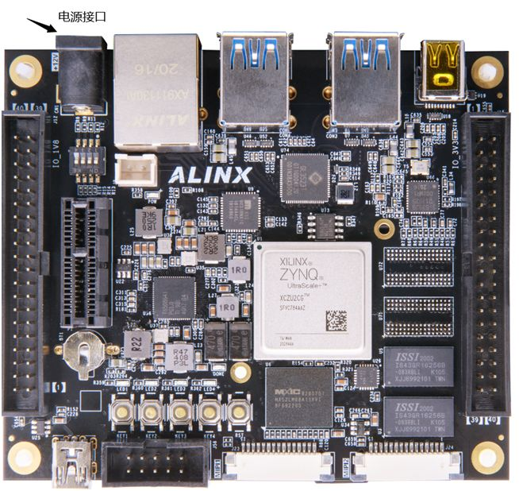

# zynq ZU2CG chip ultrascale + MPSoC FPGA, axu2cgb board

  

## Original statement:
 
This original tutorial was created by Xinyi Electronic Technology (Shanghai) Co., Ltd. (ALINX). The copyright belongs to our company. If you need to reprint, you need to authorize and indicate the source.

## Introduction:
 
AXU2CGA/B is characterized by its small size and extensive peripherals. The main chip adopts Xilinx's Zynq UltraScale+ MPSoCs CG series chip, the model is XCZU2CG-1SFVC784E. Two DDR4 (1GB, 32bit) and one 256Mb QSPI FLASH are mounted on the PS side of AXU2CGA. The PS side of AXU2CGB is equipped with 4 DDR4 (2GB, 32bit), 1 8GB eMMC FLASH memory chip and 1 256Mb QSPI FLASH.
 
 
Peripheral interfaces include 1 MINI DP interface, 4 USB3.0 interfaces, 1 Gigabit Ethernet interface, 1 USB serial port, 1 PCIE interface, 1 TF card interface, 2 40-pin expansion ports, 2 MIPI Interface and button LEDs.
 
 
The following figure shows the structure diagram of the entire development system:
 
 
The main goal of the project is to create an autonomous Wi-Fi weather station based on STM32F103. ESP-01 is used for transmitt data to server and BME280 for getting temperature, humidity, pressure readings. In the future, this weather station will become part of the smart home.

  

## ZYNQ chip
The PS system of the XCZU2CG-1SFVC784E chip integrates two ARM Cortex™-A53 processors with a speed of up to 1.2Ghz and supports level 2 Cache; it also contains two Cortex-R5 processors with a speed of up to 500Mhz.
 
 
XCZU2CG supports 32-bit or 64-bit DDR4, LPDDR4, DDR3, DDR3L, LPDDR3 memory chips, with rich high-speed interfaces on the PS side such as PCIE Gen2, USB3.0, SATA 3.1, DisplayPort; it also supports USB2.0, Gigabit Ethernet, SD/SDIO, I2C, CAN, UART, GPIO and other interfaces. The PL end contains a wealth of programmable logic units, DSP and internal RAM. The overall block diagram of the XCZU2CG chip is shown in the figure below

  

Overall block diagram of ZU2CG chip
 
 
The main parameters of the PS system are as follows:
 
- ARM dual-core Cortex™-A53 processor, with a speed of up to 1.2GHz, each CPU has 32KB level 1 instruction and data cache, and 1MB level 2 cache is shared by 2 CPUs.
 
- ARM dual-core Cortex-R5 processor with a speed of up to 500MHz, 32KB per CPU level 1 instruction and data cache, and 128K tightly coupled memory.
 
- External storage interface, support 32/64bit DDR4/3/3L, LPDDR4/3 interface.
 
- Static storage interface, support NAND, 2xQuad-SPI FLASH.
 
- High-speed connection interface, support PCIe Gen2 x4, 2xUSB3.0, Sata 3.1, DisplayPort, 4x Tri-mode Gigabit Ethernet.
 
- Common connection interfaces: 2xUSB2.0, 2x SD/SDIO, 2x UART, 2x CAN 2.0B, 2x I2C, 2x SPI, 4x 32b GPIO.
 
- Power management: Support the division of four parts of power supply Full/Low/PL/Battery.
 
- Encryption algorithm: support RSA, AES and SHA.
 
- System monitoring: 10-bit 1Mbps AD sampling for temperature and voltage detection.
 
 
The main parameters of the PL logic part are as follows:
 
- Logic Cells: 154K;
 
- Flip-flops: 141K;
 
- Lookup table LUTs: 71K;
 
- Block RAM: 9.4Mb;
 
- Clock Management Units (CMTs): 3
 
- Multiplier 18x25MACCs: 360
 
The speed grade of XCZU2CG-1SFVC784E chip is -1, commercial grade, and the package is SFVC784.
 

## DDR4 DRAM
The PS side of the AXU2CGA board is equipped with two Micron DDR4 chips, which form a 32-bit data bus bandwidth and a total capacity of 1GB. The PS side of the AXU2CGB board is equipped with 4 Micron DDR4 chips, which form a 64-bit data bus bandwidth and a total capacity of 2GB. The maximum operating speed of DDR4 SDRAM on the PS side can reach 1200MHz (data rate 2400Mbps). The specific configuration of DDR4 SDRAM is shown below.
 
Among them, U71 and U72 are only mounted on AXU2CGB.

  

 
The hardware connection of DDR4 on the PS side is shown in Figure 3-1:

  

 
Figure 3-1 PS side DDR4 DRAM schematic diagram part

## QSPI Flash
AXU2CGA/B is equipped with a 256MBit Quad-SPI FLASH chip, model MT25QU256ABA1EW9-0SIT. QSPI FLASH is connected to the GPIO port of BANK500 in the PS part of the ZYNQ chip. Figure 4-1 shows the part of QSPI Flash in the schematic.

  

Figure 4-1 Schematic diagram of QSPI Flash connection
 

## eMMCFlash (only AXU2CGB mounting)
AXU2CGB is equipped with an eMMC FLASH chip with a capacity of 8GB. eMMC FLASH is connected to the GPIO port of BANK500 of PS part of ZYNQUltraScale+. Figure 5-1 shows the part of eMMCFlash in the schematic diagram.

  

Figure 5-1 eMMCFlash connection diagram
 

## EEPROM
The AXU2CGA/B development board has a piece of EEPROM onboard, the model number is 24LC04. The I2C signal of the EEPROM is connected to the MIO port on the PS side of the ZYNQ. Figure 6-1 is the schematic diagram of EEPROM

  

Figure 6-1 EEPROM schematic part
 

## DP display interface
AXU2CGA/B has a MINI-type DisplayPort output display interface for video image display, and supports up to 4K x 2K@30Fps output. The TX signals of LANE0 and LANE1 of ZU2CG PS MGT are connected to the DP connector in a differential signal mode. The DisplayPort auxiliary channel is connected to the MIO pin of the PS. The schematic diagram of the DP output interface is shown in Figure 7-1:

  

Figure 7-1 Schematic diagram of DP interface design
 

## USB interface
There are 4 USB3.0 ports on the AXU2CGA/B board, the ports are in HOST working mode (Type A), and the data transmission speed is up to 5.0Gb/s. USB3.0 connects external USB PHY chip and USB3.0 HUB chip through ULPI interface to realize high-speed USB3.0 data communication.

 
 
The schematic diagram of USB connection is shown in 8-1:

  

Figure 8-1 Schematic diagram of USB interface
 

## Gigabit Ethernet interface
There is 1 Gigabit Ethernet interface on AXU2CGA/B, and the Ethernet interface is on BANK502 of PS connected through GPHY chip. The GPHY chip uses the KSZ9031RNXIC Ethernet PHY chip from Micrel, and the PHY Address is 001. Figure 9-1 is a schematic diagram of the connection of the Ethernet PHY chip on the ZYNQ PS side:

  

Figure 9-1 Schematic diagram of connection between ZYNQ PS system and GPHY
 

## USB Uart interface
The AXU2CGA/B board is equipped with a Uart to USB interface for system debugging. The conversion chip adopts the USB-UAR chip of Silicon Labs CP2102, and the USB interface adopts the MINI USB interface. You can use a USB cable to connect it to the USB port of the upper PC for independent power supply of the core board and serial data communication. The schematic diagram of the USB Uart circuit design is shown in the figure below:

  

Figure 10-1 Schematic diagram of USB to serial port
 

## SD card slot
The AXU2CGA/B board contains a MicroSD card interface. The SDIO signal is connected to the IO signal of BANK501. The schematic diagram of the SD card connector is shown in Figure 11-1.

  

Figure 11-1 Schematic diagram of SD card connection
 

## PCIE interface
AXU2CGA/B is equipped with a PCIE x1 slot for connecting PCIE peripherals, and the PCIE communication speed is up to 5Gbps. The PCIE signal is directly connected to LANE0 of the BANK505 PS MGT transceiver. The schematic diagram of PCIE x 1 design is shown in Figure 12-1:

  

Figure 12-1 Schematic diagram of PCIE interface design
 

## 40-pin expansion port
The AXU2CGA/B board reserves two 40-pin expansion ports with a standard pitch of 2.54mm. Each expansion port contains two 3.3V power supplies, one 5V power supply, three grounds and 34 IO ports. The IO port of the J12 expansion port is connected to the ZYNQ chip BANK66. The level standard is 1.8V. Be careful not to plug in devices other than 1.8V. The IO port of the J15 expansion port is connected to the ZYNQ chip BANK25 and BANK26, and the level standard is 3.3V. The schematic diagram of the design is shown in Figure 13-1:

  

Figure 13-1 Schematic diagram of expansion port design
 

## MIPI interface
There are 2 MIPI interfaces on the AXU2CGA/B board for connecting MIPI cameras. The differential signal of MIPI is connected to the HP IO of BANK64 and 65, and the level standard is +1.2V; the control signal of MIPI is connected to BANK24, and the level standard is +3.3V. The schematic diagram of the MIPI port design is shown in Figure 14-1:

  

Figure 14-1 Schematic diagram of MIPI interface connection
 

## JTAG debug port
A 10-pin JTAG interface is reserved on the AXU2CGA/B board for downloading ZYNQUltraScale+ programs or firmware programs to FLASH. The pin definition of JTAG is shown in the figure below

  

Figure 16-1 JTAG interface pin definition
 

## DIP switch configuration
There is a 4-digit DIP switch on the board to configure the startup mode of the ZYNQ system. The AXU2CGA/B system supports 4 startup modes. The 4 startup modes are JTAG debug mode, QSPI FLASH, EMMC and SD2.0 card startup mode. After the chip is powered on, it will detect the level of (PS_MODE0~3) to determine the startup mode. The user can select different startup modes through the dial switch. The SW1 startup mode configuration is shown in Table 17-1 below.

  

Table 17-1SW1 startup mode configuration
 

## LED lights
There are 4 user indicator lights, 4 user control buttons and a reset button on the AXU2CGA/B board. 4 user indicators and 4 user buttons are all connected to the IO of BANK24. The schematic diagram of the LED light hardware connection is shown in Figure 18-1:

  

Figure 18-1 Schematic diagram of LED light hardware connection
 

## System clock
The board provides reference clocks for the RTC circuit, PS system, and PL logic parts. The RTC clock is 32.768, the PS system clock is 33.3333Mhz, and the PL end clock is 25Mhz. The schematic diagram of the clock circuit design is shown in Figure 19-1:

  

Figure 19-1 Clock source
 
 
The level of PL_REF_CLK is +1.8V.

## Fan interface
The fan is powered by 12V, and the speed can be adjusted through the FAN_PWM signal.

## power supply
The power input voltage of AXU2CGA/B is an adapter with DC12V and current 2A. The power interface is shown in the figure below, try to use the power adapter provided by us.

  

Figure 20-1 Power interface
 

## Structure size chart

  

Figure 21-1 Front view (Top View)

